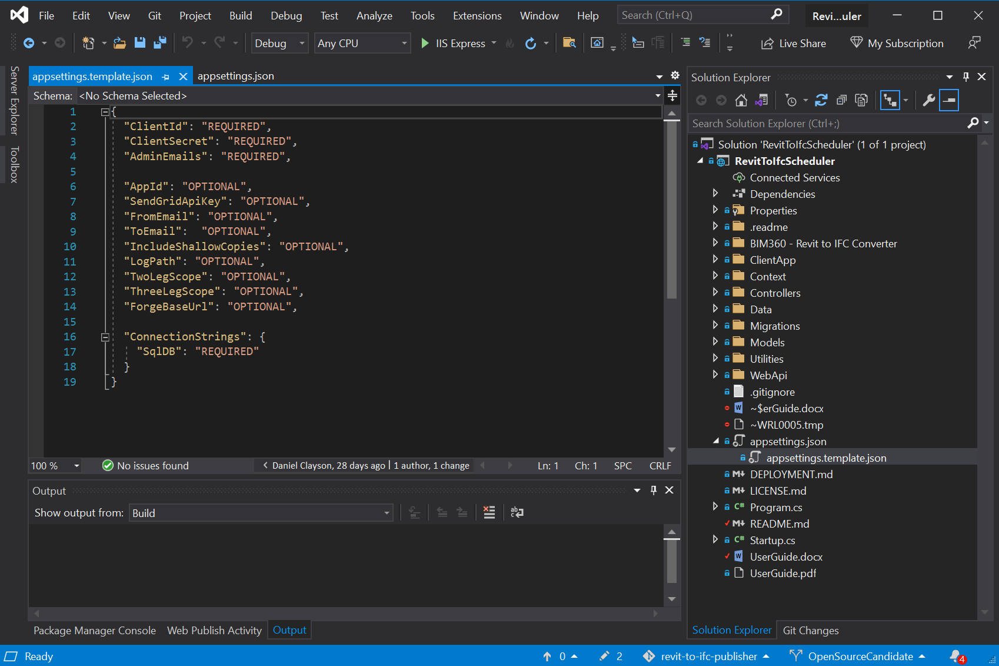
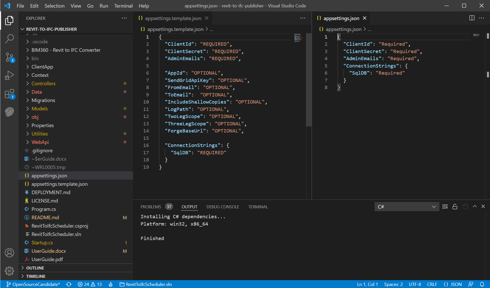

# Revit to IFC Scheduler

### Contents

* [Description](#description)
* [Setup](#setup)
* [Using the Application](#using-the-application)
* [Tips and Tricks](#tips-and-tricks)
* [License](#license)


## Description

This code sample demonstrates the usage of Model Derivative API, which allows you to convert a Revit `.rvt` file stored in BIM 360 Docs to `.ifc` format.

The [IFC file format](https://technical.buildingsmart.org/standards/ifc/) is a common transfer format used throughout the world, and consumed by a wide range of applications. You can use this tool to automate tasks to convert Revit Files hosted in BIM 360 Docs to IFC on a recurring basis.

Users choose either folders or specific files, then choose an IFC Settings Set name, and set a schedule on which the folders or files should be converted to IFC. At the scheduled time,  the application creates [model derivative](https://forge.autodesk.com/en/docs/model-derivative/v2/developers_guide/overview/) jobs for each file, and uploads the IFC file into the same folder as the original Revit file. If the Revit file and IFC Settings Set name have not changed since the last conversion, no job will be created.

**Note.** [Model Derivate API](https://forge.autodesk.com/en/docs/model-derivative/v2/developers_guide/overview/) incurs cost. To view the current cost of the Model Derivative service, and to purchase Cloud Credits for file conversions, please view the [Forge Pricing page](https://forge.autodesk.com/pricing#cloud-credits).


## Thumbnail


## Limitations

* This application will only work on Revit files that are uploaded directly to BIM 360 Docs / Autodesk Docs, or published models from cloud worksharing.


## Setup

### Prerequisites

* [Visual Studio](https://code.visualstudio.com/): Either Community 2019+ (Windows) or Code (Windows, MacOS).
* [dotNET 5.0](https://dotnet.microsoft.com/en-us/download/dotnet/5.0)
* [NodeJS (with NPM)](https://nodejs.org/en/download/)
* [SQL Server](https://www.microsoft.com/en-us/sql-server/sql-server-downloads)
  * For installing SQL Server on `Windows` machines, please see [Microsoft's SQL Server installation guide](https://docs.microsoft.com/en-us/sql/database-engine/install-windows/install-sql-server?view=sql-server-ver15)
  * For installing SQL Server on `Linux` machines, please see [Microsoft's Installation Guidance for SQL Server](https://docs.microsoft.com/en-us/sql/linux/sql-server-linux-setup?view=sql-server-ver15)
  * For `Cloud-hosted` SQL, options include:
    * [Azure SQL](https://azure.microsoft.com/en-us/products/azure-sql/)
    * [Amazon RDS for SQL Server](https://aws.amazon.com/rds/sqlserver/)
* Basic knowledge of C#
* Autodesk Forge App provisioned to your BIM 360 account

### Running locally

Clone this project or download it. It's recommended to install [GitHub desktop](https://desktop.github.com/). To clone it via command line, use the following (**Terminal** on MacOSX/Linux, **Git Shell** on Windows):

```bash
git clone https://github.com/Autodesk-Forge/forge-revit.ifc.scheduler.git
```

* **Visual Studio** (Windows):

    Open the project [RevitToIfcScheduler.csproj](RevitToIfcScheduler.csproj), find [appsettings.template.json](appsettings.template.json) in the solution window, copy and rename it to `appsettings.Development.json`.



* **Visual Studio Code** (Windows, MacOS):

    Open the folder, at the bottom-right, select **Yes** and **Restore**. This restores the packages (e.g. Autodesk.Forge) and creates the launch.json file.

    Afterward, find [appsettings.template.json](appsettings.template.json) in the explore window, copy and rename it to `appsettings.Development.json`.



Edit the `appsettings.Development.json` file, adding your Forge Client ID, Secret, emails for Application Admins, and your SQL Database connection string.

```json
{
  "ClientId": "your id here",
  "ClientSecret": "your secret here",
  "AdminEmails": "your admin user emails here",
  "ConnectionStrings": {
    "SqlDB": "your sql server connection string here: e.g. Server=localhost;Database=RevitIFCScheduler;User=sa;Password=...;"
  }
}
```

Run the app. Open `http://localhost:3000` in your browser to view the application.

### App Settings Variables

Name | Description | Example Value
--- | --- | ---
ForgeClientId | From the Forge App created during Setup | _CL35ag54e6aghsaf4cacwe_
ForgeClientSecret | From the Forge App created during Setup | _aa46asffaws_
AdminEmails | Semicolon-separated list of email addresses | _admin@mycompany.com;bimmanager@mycompany.com_
ConnectionStrings.SqlDB | A SQL connection String |  _Server=MY-SERVER;Database=revit-to-ifc-scheduler;Trusted_Connection=True;ConnectRetryCount=0_

#### Optional App Settings

Name | Description | Default Value
--- | --- | ---
AppId | A name for the application, used when naming cookies and buckets | revit-to-ifc
SendGridApiKey | If email notifications are desired, an API key from SendGrid should be provided | _null_
FromEmail | The email address that SendGrid should attempt to put into the 'From' field | _null_
ToEmail | The email address that SendGrid should attempt to put into the 'To' field | _null_
LogPath | The specific path where log files should be stored | _null_
IncludeShallowCopies | Copying a file in BIM 360 does not create a new file, only a reference to the original file, and cannot be passed to the model derivative service. Setting this to true will make a true copy of the file, and pass that to the model derivative service.  | true
TwoLegScope | The Forge scopes used by two legged tokens | data:read data:create account:read
ThreeLegScope | The Forge scopes used by three legged tokens | user:read data:read
ForgeBaseUrl | The root URL used to connect to the Forge platform | https://developer.api.autodesk.com

### Deployment Steps
 
Please see the [Deployment Guide](./DEPLOYMENT.md).


## Using the Application

Please see the [User Guide.pdf](./UserGuide.pdf) for additional details.

#### Initial Setup

1. Navigate to the tool using your browser.
2. Log in using your BIM 360 account (your email address must be included in the AdminEmails Environment Setting)
3. Navigate to Settings by clicking `Settings` in the top right corner
4. Toggle on the desired BIM 360 accounts. 
5. Add an IFC Settings Set Name using the `Add IFC Settings Set Name` button.

    **Note.** Check out `What does an IFC Settings Set Contain?` in the [Further Reading](#further-reading) section, if you don't know what it is.

#### Creating a one-off conversion to IFC

1. Navigate to the tool using your browser.
2. Log in using your BIM 360 account.
3. Choose a project on the left-hand side.
4. Navigate through the folder tree until you see the desired folders or files.
5. Select the checkboxes next to the desired folders or files.
6. Press `Convert Selected to IFC Now` in the upper right-hand corner.
7. Choose the desired IFC Settings Set Name, or type in a new name.
8. The conversion will begin immediately, but may take several minutes to complete.
9. To view the status of the conversion, press the `Conversion History` button to see all past conversions within this project.

#### Creating a scheduled conversion to IFC

1. Navigate to the tool using your browser.
2. Log in using your BIM 360 account.
3. Choose a project on the left-hand side.
4. Navigate through the folder tree until you see the desired folders or files.
5. Select the checkboxes next to the desired folders or files.
6. Press `Create Schedule Conversion` in the upper right-hand corner.
7. The application will automatically create a scheduled run on a daily schedule.
8. You may change the following settings for the schedule: 
   1. Schedule Name
   2. IFC Settings Set Name
   3. Frequency (Daily, Weekly, etc.)
   4. The days on which the schedule should repeat
   5. The time at which the schedule should repeat
   6. The time zone at which the schedule should repeat
9. The conversion will begin at the next scheduled event.
10. To view the status of the conversion, press the `Conversion History` button to see all past conversions within this project.

#### Conversion Statuses

Name | Description
--- | ---
Created | The IFC conversion job is created and enqueued successfully.
Processing | The Revit model has been sent to the Model Derivative service, and is being converted to IFC.
Converted | The model has been converted to IFC, but has not yet been uploaded to BIM 360 Docs.
Success | The status of the IFC conversion job is success and has been uploaded to the BIM360 Docs folder where the source Revit file is.
Failed | The conversion or upload could not be completed. Please click the conversion record for more details.
Unchanged | This model has previously been converted to IFC using the same IFC setting set. No additional conversion is required.
ShallowCopy | The selected Revit file is a copy, rather than an uploaded file. To convert this file, set `AllowShallowCopies` to `true` in your [App Settings Variables](#app-settings-variables).
TimeOut | The Forge Model Derivative service has returned a [timeout error](https://forge.autodesk.com/en/docs/model-derivative/v2/reference/http/urn-manifest-GET/#body-structure-200).


# Further Reading

Documentation:

- [BIM 360 API](https://forge.autodesk.com/en/docs/bim360/v1/overview/) and [App Provisioning](https://forge.autodesk.com/blog/bim-360-docs-provisioning-forge-apps)
- [Data Management API](https://developer.autodesk.com/en/docs/data/v2/overview/)
- [Model Derivative API](https://forge.autodesk.com/en/docs/model-derivative/v2/developers_guide/overview/)

Related knowledge:

- [What is IFC?](https://bimconnect.org/en/software/what-is-ifc/)
- [About Revit and IFC](https://knowledge.autodesk.com/support/revit/learn-explore/caas/CloudHelp/cloudhelp/2022/ENU/Revit-DocumentPresent/files/GUID-6708CFD6-0AD7-461F-ADE8-6527423EC895-htm.html)
- [What does an IFC Settings Set Contain?](https://knowledge.autodesk.com/support/revit/learn-explore/caas/CloudHelp/cloudhelp/2022/ENU/Revit-DocumentPresent/files/GUID-E029E3AD-1639-4446-A935-C9796BC34C95-htm.html)

### Tips and Tricks:

###### Sending Confirmation Emails

This tool uses SendGrid to send a confirmation email on a successful conversion. This requires creating a free SendGrid account (for up to 25,000 emails/month), verifying a 'Single Sender' email address, and retrieving an API Key with 'Send' authorization. Three optional environment settings must be set: `SendGridApiKey`, `FromEmail`, and `ToEmail`. If any one of these is left blank, no emails will be sent. 

SendGrid can be setup by creating an account at [www.sendgrid.com](https://www.sendgrid.com), or by creating a `SendGrid Accounts` resource from the [Azure Portal](https://portal.azure.com/#create/Sendgrid.sendgrid).

###### Internationalization - Additional Language Support

This application is capable of supporting multiple languages -- by default, English and Norwegian have been provided. To add additional languages, copy the folder located at `BIM360 - Revit to IFC Converter/ClientApp/public/locales/en`, and rename it with the appropriate language code. Search for the file named `i18next.ts`, and add the language code to the `fallbackLng` array. Finally, edit the `translation.json` and `scheduler.json` files in the folder that you just copied, and set the values on the right hand side to the appropriate translation.

When this is done, an additional language code will be shown in the header bar of the application.

###### Shallow Copies

When a file is 'shallow copied', and BIM 360 makes a reference to a file that's already claimed by another BIM360 file, it can't be processed via the Model Derivative service. This happens within 'Shared' folders, and when a user makes use of the 'copy' function. The `IncludeShallowCopies` optional environment setting allows us to get around this, by making a copy of the file on OSS, then translating that instead.

###### Modifying the Database

This tool uses Entity Framework Core in a code-first, migration based setup. Provide it with a connection  string, and it will automatically create or update the database and tables as needed.

When the tables are modified in the Data project, you will need to create a new Migration. Do do this, navigate to the 'BIM360 - Revit to IFC Converter' project, and run the following command: `dotnet ef migrations add NameOfYourMigrationHere`. The migration will be applied during the next application run.

### Troubleshooting

1. **Cannot see my BIM 360 projects**:
    * Make sure to provision the Forge App Client ID within the BIM 360 Account, [learn more here](https://forge.autodesk.com/blog/bim-360-docs-provisioning-forge-apps). (This requires the Account Admin permission)
    * Also, check **section 2.1 Login** and **section 2.3.1 Enabling a BIM360 account** of [UserGuide.pdf](UserGuide.pdf) for instructions.

2. **Received Microsoft.Data.SqlClient.SqlException while starting this app**: if it indicates that `there is already an object named 'XXXXX' in the database`, then this means the database you specified in `appsetings.json` is not empty. You can fix it by doing either of the below ways:
    * Comment out the `dbContext.Database.Migrate();` in [Startup.cs](Startup.cs), then restart the app.
    * Backup your database, erase the database by executing `DROP DATABASE` command in the [SQL Server Management Studio](https://docs.microsoft.com/en-us/sql/ssms/sql-server-management-studio-ssms?view=sql-server-ver15), and then restart the app.

3. **See 401 Unauthorized error after logging in**:
    * Check if the user level of the user account you logged in matches the listed roles of the  **section 2.1 Login** of [UserGuide.pdf](UserGuide.pdf).
    * If the user level of your user account is `Application Admins`, ensure that your user email is specified in the `AdminEmails` of the [App Settings Variables](#app-settings-variables).
 
## License

This application is licensed under Apache 2.0. For details, please see [LICENSE.md](./LICENSE.md).

## Written By

* Daniel Clayson, Global Consulting Delivery Team, Autodesk
* Reviewed and maintained by Eason Kang [@yiskang](https://twitter.com/yiskang), [Forge Partner Development](http://forge.autodesk.com)